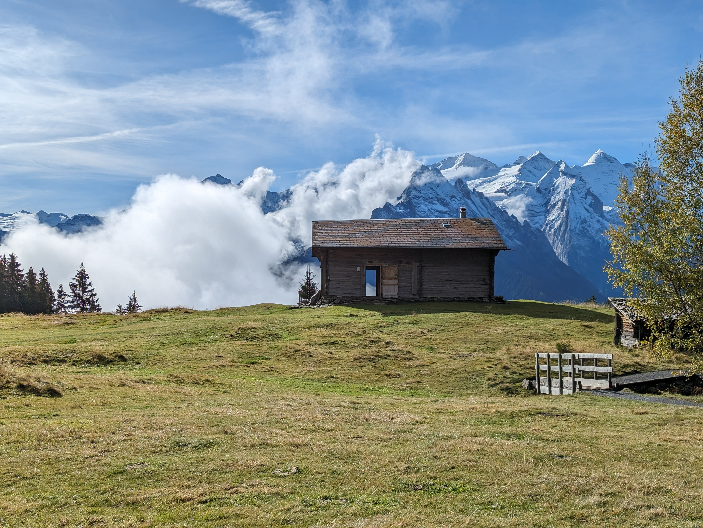

# Delta Happiness
If you know, you know

We exude bb top energy.

## Events

### Ideas
| **Idea** | **Cost [CHF]** | **Link** |
|---|---|---|
| Hot pot in Germany | big money |  |
| Trampoline park in Rümlang  | medium money | https://www.fliplab.ch/zurich/ |
| Day trip to Ticino (have you been to Verzascatal for example) but also this should only be done once they fix the stupid tunnel | 20 for those poor folks without a GA |  Zug Zug Zug Zug Zug Zug Zug Zug|
| Barefoot hike in Appenzell   <i>Yong Da: what in the Alabama is this?<i/>| 20  | https://zurich.esn.ch/event/2810 |
| Potluck picnic |  |  |
| Someone buy a spikeball kit and play at a lake or river  | cheap: 31.80, medium: 56.60, expensive: 91.90 | https://www.galaxus.ch/de/s5/product/mint-lama-spikeball-strandspiele-13954297, https://www.galaxus.ch/de/s5/product/spikeball-spikeball-set-strandspiele-13842467, https://www.galaxus.ch/de/s5/product/spikeball-pro-set-strandspiele-14911541  |
| Ride around Greifensee | 0  | https://zurich.esn.ch/event/2764 |
| Hike up Uetliberg at night | 0  | https://zurich.esn.ch/event/2735 |
| Play the dice decides which train to take next  | 20  |  |
| Go to some Swiss city with no phone usage and explore | 20 | |
| Hide and seek at Honggerberg  | 0 | |
| Go see Rheinfall lit up at night  | 0 for those with night GA | https://rheinfall.ch/de/erleben/erleben/attraktionen/rheinfall-beleuchtung.html|
| Fold origami in the forest at night (bring candles for light or make a fire whatever you prefer)| 0 |  |

### Planned
| **Plan** | **Date** | **Attendees** | 
|---|---|---|
| bruh we ain't got no plan | | 
| try to have deep conversations after eating super spicy food | Mon, Dec 11, 2023 | Not Arthur | 

### Completed
| **Plan** | **Date** | **Attendees** | 
|---|---|---|
| Weekend in Hasliberg | 20 - 22 October 2023 | Yong Da, Emma x2, Arthur, Atien, Jose, Kevin, Yimeng |
| Karaoke at Yong Da's while his roommate is in Nicaragua and during the day so as not to disturb old granny | Wed, Nov 1, 2023  | Dylan, Eric, Sami, Emma S., Recep, Arthur, Atien, Sean|
| Go ice skating after classes until 22.30, 16CHF, https://www.doldersports.com/winter-front-page/kunsteisbahn/ | Wed, Nov 8, 2023 | Yong Da, Alex, Arthur, Atien, Dylan, Emma S., Kevin
| Everyone brings an ingredient that starts with the same letter as their first or last name and then cook whatever ChatGPT comes up with | Fri, Nov 25, 2023 | Yong Da, Alex, Arthur, Atien, Emma S., Jose, Kevin, Yimeng : **we managed to burn soup**
| Christmas market and night hike at Einsiedeln | Sat, Dec 2, 2023 | Yong Da, Arthur, Atien, Emma, Jose, Kevin, Recep|

 

# Quotes
> Emma S.: Why wouldn't the witch just do it for the memes?

> Yong Da: Viagra should be kind of like coffee.

> Jose: [*in a sad voice*] it's just one more app

> Emma S.: Do you want to play "Who is Afraid of the Black Man"?

> Emma S.: [*on the topic of grocery stores closing early*] Yeah see Zurich is actually really great, cause other cantons have much stricter opening hour laws. In a lot of cantons all stores close at 7PM. There was a referendum In Zug to have longer opening hours two years ago but 65% of people said no.

# Very important questions to discuss

You people gotta add stuff here I already added the great excursion ideas. 

But also if someone you loved was killed in front of you, but someone created a copy of them that was perfect right down to the atomic level, would they be the same person and would you love them just as much? 
Oh, and also what would you genetically change about humans to make them a better species?

How transactional are human relationships? And how transactional should they be?

Selling out to the US military industrial complex?

Best names for their profession/job? Ex. if Stephen Curry worked at an Indian restaurant.

What would a potential future culture and political system look like on a Mars colony?

Perfect number of people for a:
- camping trip
- ski trip
- orgy
- dinner party

Weirdest thing someone can pull out of their pocket?

Absolute power corrupts absolutely?

Is history decided by "great men" (aka individual people) or the masses?

How much should drugs/medicine, technology, and statistics be allowed in sports? 
- example drugs/medicine: Tour de France doping
- example technology: Nike AlphaFly shoe or full-body swims suits
- example statistics: A basketball team only runs 5x plays because they are the most efficient/highest scoring plays, leading to boring spectatorship, leading to less money into the league.

How much social media should celebrities engage in?

Lossless data compression is the same problem as general artificial intelligence. Discuss.

Regardless of culture, socio-economic status, and period in history, what are constants in the human condition?

If you could see the future and know that you'll have a child who dies at age 10, would you still have the child?

# Archive

We need memes here. Like actual memes of us. \
Also someone needs to start taking more pictures.

